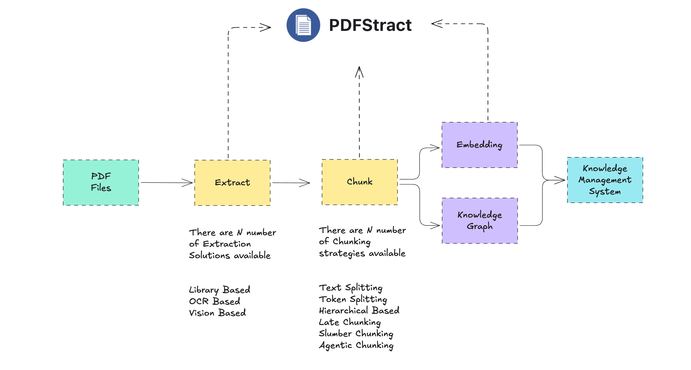

# PDFStract — Unified PDF Ingestion for RAG Systems


<p align="center">
  
</p>

<p align="center">
  
  
  
  
</p>


**Building RAG or AI knowledge systems?**


PDFStract is a unified PDF extraction and document ingestion layer 
for RAG (Retrieval-Augmented Generation) and LLM pipelines.

It standardizes PDF extraction, OCR handling, and text chunking 
across multiple libraries — so you can build reliable AI knowledge systems 
without fighting document parsing issues.




No single PDF extractor works best for every document.
PDFStract lets you switch, compare, and automate extraction strategies 
through a single interface.


## Why PDFStract Exists

Modern RAG and LLM systems depend on clean document ingestion.

But PDF extraction is fragmented:
- Some libraries work better for structured reports
- Others perform better on scanned or OCR-heavy documents
- Output formats vary widely
- Chunking strategies significantly impact retrieval performance

Teams often waste hours testing combinations manually.

PDFStract provides:
- A unified abstraction over multiple PDF extractors
- Standardized output formats (markdown, json, text)
- Built-in chunking strategies for RAG pipelines
- Easy benchmarking and comparison between libraries

It becomes the standardized ingestion layer of your AI data pipeline.

Get started in two lines

```python
from pdfstract import PDFStract
ps=PDFStract()
# convert and chunk in a single step with auto mode
chunks=ps.convert_chunk("path/to/pdf", library="auto", chunker="auto")

# or do it in two steps
# convert first with your library of choice
md_content=ps.convert("path/to/pdf", library="docling")

# chunk with your chunking technique of choice
# Chunk the text
chunks = pdfstract.chunk(text, chunker='token' chunk_size=512, chunk_overlap=50)

```

## What Makes PDFStract Different?

Instead of committing to a single PDF extraction library,
PDFStract lets you:

- Swap extractors with one parameter
- Benchmark multiple libraries on the same document
- Automate library selection
- Standardize downstream processing
- Keep your ingestion layer future-proof

As new extraction libraries emerge,
PDFStract allows you to integrate them without rewriting your pipeline

>PDFStract decouples your ingestion layer from any single extraction library.

## Installation and Usage

Choose based on required extraction libraries.

```bash
pip install pdfstract
pip install pdfstract[standard]
pip install pdfstract[advanced]
pip install pdfstract[all]
```


### CLI Usage

```bash
# List available libraries
pdfstract libs

# List available chunkers
pdfstract chunkers

# Convert a single PDF
pdfstract convert document.pdf --library pymupdf4llm --output result.md

# Convert and chunk in one command
pdfstract convert-chunk document.pdf --library pymupdf4llm --chunker semantic --output chunks.json

# Chunk an existing text file
pdfstract chunk document.md --chunker token --chunk-size 512 --output chunks.json

# Compare multiple libraries on one PDF
pdfstract compare sample.pdf -l pymupdf4llm -l marker -l docling --output ./comparison

# Batch convert 100+ PDFs in parallel
pdfstract batch ./documents --library pymupdf4llm --output ./converted --parallel 4

# Download models for a specific library
pdfstract download marker
```

### Module Usage with Python 

You don't need to use the CLI! PDFStract can be easily integrated into your Python applications as a library. 

#### Convert a PDF (One-liner)

```python
from pdfstract import convert_pdf

# Quick conversion with default settings
result = convert_pdf('sample.pdf', library='marker')
print(result)  # Markdown content
```

#### List Available Libraries

```python
from pdfstract import PDFStract

pdfstract = PDFStract()

# Get list of available libraries
available = pdfstract.list_available_libraries()
print(available)  # ['pymupdf4llm', 'marker', 'docling', ...]
```

#### Structured Conversion

```python
from pdfstract import PDFStract

pdfstract = PDFStract()

# Convert with options
result = pdfstract.convert(
    pdf_path='document.pdf',
    library='marker',
    output_format='markdown'  # or 'json', 'text'
)
```

#### Batch Processing Multiple PDFs

```python
from pdfstract import PDFStract

pdfstract = PDFStract()

# Convert all PDFs in a directory in parallel
results = pdfstract.batch_convert(
    pdf_directory='./pdfs',
    library='pymupdf4llm',
    output_format='markdown',
    parallel_workers=4
)

print(f"✓ Success: {results['success']}")
print(f"✗ Failed: {results['failed']}")
```

#### Async Conversion (for Web Apps)

```python
import asyncio
from pdfstract import PDFStract

async def process_pdfs():
    pdfstract = PDFStract()
    result = await pdfstract.convert_async(
        'document.pdf',
        library='docling',
        output_format='json'
    )
    return result

# Use in FastAPI, asyncio, etc.
asyncio.run(process_pdfs())
```

#### Text Chunking for RAG Pipelines

```python
from pdfstract import PDFStract

pdfstract = PDFStract()

# 1. Extract PDF
text = pdfstract.convert('document.pdf', library='docling')

# 2. Chunk the text
chunks = pdfstract.chunk(
    text=text,
    chunker='semantic',  # or 'token', 'sentence', 'code', etc.
    chunk_size=512
)

print(f"Created {chunks['total_chunks']} chunks")

# 3. Process chunks for embedding/indexing
for chunk in chunks['chunks']:
    print(f"- {chunk['text'][:50]}... ({chunk['token_count']} tokens)")
```

### Powerful Web UI

```python
# Clone the repository
git clone https://github.com/aksarav/pdfstract.git
cd pdfstract

# Download models and start services (first time)
make up

# Or step by step:
make models   # Download HuggingFace/MinerU models (~10GB)
make build    # Build Docker images
make up       # Start services
```


## Used For

- RAG systems
- Document intelligence pipelines
- Knowledge base ingestion
- LLM fine-tuning datasets


## 🤝 Contributing

Contributions are welcome! Please:

1. Fork the repository
2. Create a feature branch
3. Make your changes
4. Submit a pull request


## 📞 Support

If you encounter issues or have questions - please create an issue

## 🌟 Please leave a star if you find this project useful


**Made with ❤️ for AI RAG pipelines**
