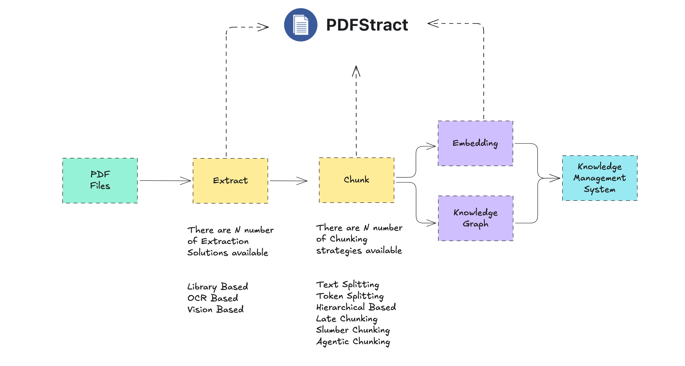
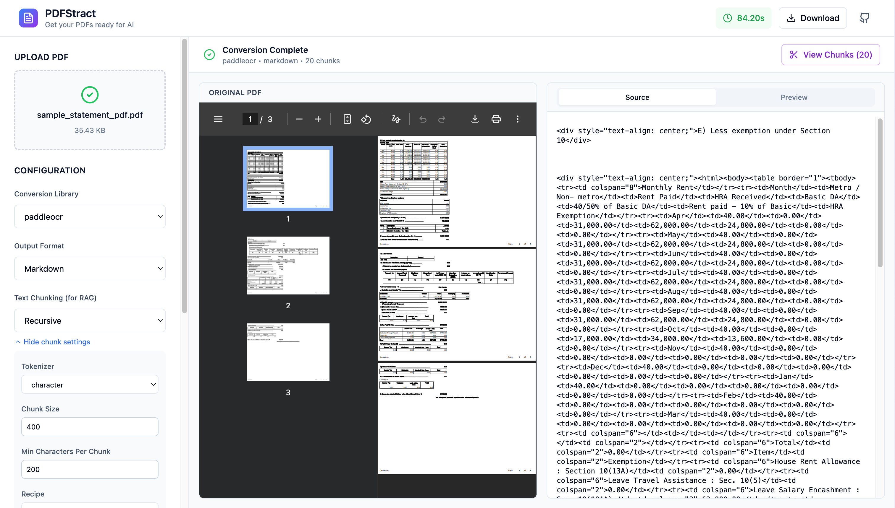
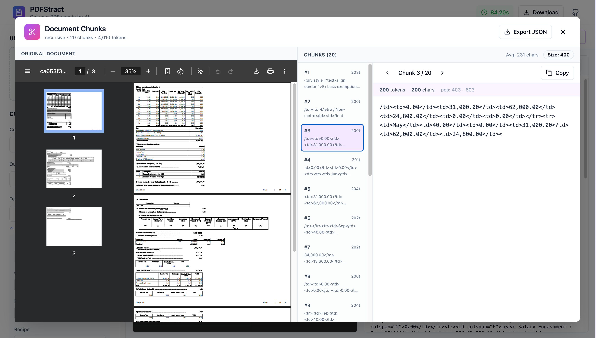

# PDFStract — The Unified Data Preparation Layer for RAG 

<p align="center">
  
</p>

<p align="center">
  <strong>Extract. Chunk. Embed in one line of code.</strong>
</p>

<p align="center">
  
  
  
  
</p>

**One unified API.** Switch between 10+ extraction libraries, 10+ chunking methods, and multiple embedding providers with a single parameter change. Focus on your RAG outcomes, not library dependencies.



## Quick Start

```python
from pdfstract import PDFStract

pdfstract = PDFStract()

# Complete pipeline: Extract → Chunk → Embed
result = pdfstract.convert_chunk_embed('document.pdf')

# Or step by step
text = pdfstract.convert('document.pdf', library='auto')
chunks = pdfstract.chunk(text, chunker='semantic', chunk_size=512)
vectors = pdfstract.embed_texts([c['text'] for c in chunks['chunks']])
```

```bash
# CLI: Full pipeline in one command
pdfstract convert-chunk-embed document.pdf --library auto --chunker auto --embedding auto
```

## Installation

```bash
pip install pdfstract              # Base - pymupdf4llm, markitdown
pip install pdfstract[standard]    # + OCR (pytesseract, unstructured)
pip install pdfstract[advanced]    # + ML-powered (marker, docling, paddleocr)
pip install pdfstract[all]         # Everything
```

## Why PDFStract?

No single PDF extractor, chunker, or embedding provider works best for every document.

PDFStract lets you **swap, compare, and automate** your data preparation strategy through a single API:

- **Extract**: 10+ libraries (Marker, Docling, PyMuPDF4LLM, PaddleOCR, Unstructured, and more)
- **Chunk**: 10+ methods (Token, Semantic, Sentence, Recursive, Code-aware, and more)
- **Embed**: Multiple providers (OpenAI, Azure, Google, Ollama, Sentence Transformers)

Switch any component with a single parameter change. No code refactoring needed.


## Python API

### Extract

```python
from pdfstract import PDFStract

pdfstract = PDFStract()

# Auto-select best available library
text = pdfstract.convert('document.pdf', library='auto')

# Use specific library
text = pdfstract.convert('document.pdf', library='marker')
text = pdfstract.convert('document.pdf', library='docling', output_format='json')

# Batch processing
results = pdfstract.batch_convert('./pdfs', library='pymupdf4llm', parallel_workers=4)

# Async
text = await pdfstract.convert_async('document.pdf', library='marker')
```

### Chunk

```python
# Token-based chunking
chunks = pdfstract.chunk(text, chunker='token', chunk_size=512, chunk_overlap=50)

# Semantic chunking
chunks = pdfstract.chunk(text, chunker='semantic', chunk_size=1024)

# Access results
for chunk in chunks['chunks']:
    print(f"Chunk {chunk['chunk_id']}: {chunk['token_count']} tokens")
```

### Embed

```python
# Embed multiple texts
vectors = pdfstract.embed_texts(["First text", "Second text"], model='sentence-transformers')

# Embed single text
vector = pdfstract.embed_text("Hello world", model='openai')

# List available providers
providers = pdfstract.list_available_embeddings()
```

### Combined Pipelines

```python
# Convert + Chunk
result = pdfstract.convert_chunk('document.pdf', library='marker', chunker='semantic')

# Convert + Chunk + Embed (full RAG pipeline)
result = pdfstract.convert_chunk_embed(
    'document.pdf',
    library='docling',
    chunker='semantic',
    embedding='sentence-transformers'
)

# Each chunk has its embedding attached
for chunk in result['chunking_result']['chunks']:
    print(f"Chunk {chunk['chunk_id']}: {len(chunk['embedding'])} dimensions")
```

## CLI

```bash
# List available tools
pdfstract libs
pdfstract chunkers
pdfstract embeddings-list

# Extract
pdfstract convert document.pdf --library marker

# Chunk
pdfstract convert-chunk document.pdf --library docling --chunker semantic

# Full pipeline
pdfstract convert-chunk-embed document.pdf --embedding sentence-transformers

# Batch processing
pdfstract batch ./pdfs --library pymupdf4llm --parallel 4

# Compare libraries
pdfstract compare sample.pdf -l marker -l docling -l pymupdf4llm
```

## Web UI

```bash
git clone https://github.com/aksarav/pdfstract.git
cd pdfstract
make up
```

Open http://localhost:3000 for Web UI, http://localhost:8000 for API.





## What's Included

| Tier | Libraries |
|------|-----------|
| **Base** | pymupdf4llm, markitdown |
| **Standard** | + pytesseract, unstructured |
| **Advanced** | + marker, docling, paddleocr, deepseek, mineru |

**Chunkers:** token, sentence, semantic, recursive, code, sdpm, late, slumber, neural

**Embeddings:** OpenAI, Azure OpenAI, Google, Ollama, Sentence Transformers, Model2Vec

## Documentation

📖 **[pdfstract.com](https://pdfstract.com)** — Full documentation, guides, and API reference

## Use Cases

- RAG systems and knowledge bases
- Document intelligence pipelines
- LLM fine-tuning dataset preparation
- Semantic search applications

## Contributing

Contributions welcome! Fork, create a feature branch, and submit a pull request.

## Support

Questions or issues? [Create an issue](https://github.com/aksarav/pdfstract/issues)

---

**Made with ❤️ for AI RAG pipelines** · [GitHub](https://github.com/aksarav/pdfstract) · [PyPI](https://pypi.org/project/pdfstract)
